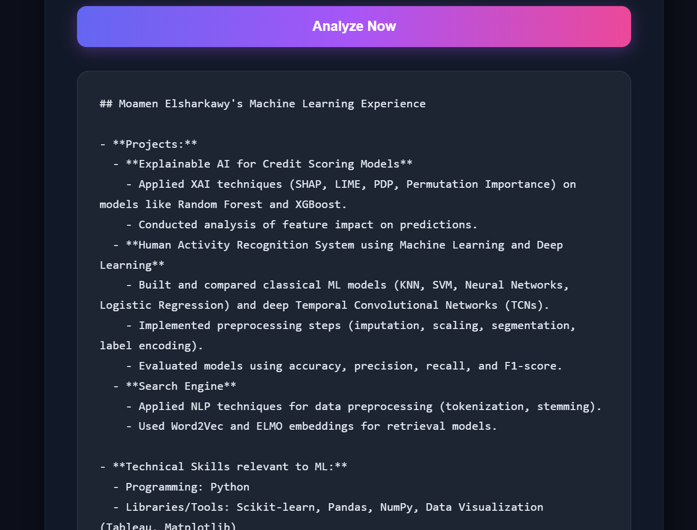

# CV AI Analyzer

**CV AI Analyzer** is a web application that allows users to upload their CV in PDF format and ask AI-powered questions about it. The AI provides professional analysis, summaries, and insights directly from the CV content using the OpenRouter GPT-4.1-mini model.

---

## Features

- Upload a CV in PDF format.
- Ask questions about your CV (e.g., summarize work experience, highlight skills).
- Receive AI-generated answers instantly.
- Clean, modern, and responsive UI.
- Handles long answers gracefully with proper word wrapping.

---

## Demo


--



---

## Technologies Used

- **Backend:** Python, FastAPI
- **Frontend:** HTML, CSS, JavaScript
- **PDF Processing:** PyPDF2
- **AI Integration:** OpenAI via OpenRouter API
- **Environment Management:** python-dotenv
- **CORS Handling:** FastAPI Middleware

---

## Installation

1. **Clone the repository:**

```bash
git clone https://github.com/Moamen-Elsharkawy/CV-AI-Analyzer.git
cd cv-ai-analyzer

2. **Create a virtual environment:**

```bash
python -m venv venv
source venv/bin/activate  # Linux/Mac
venv\Scripts\activate     # Windows
```

3. **Install dependencies:**

```bash
uv install fastapi uvicorn python-dotenv PyPDF2 openai
```

4. **Set up environment variables:**

Create a `.env` file in the root folder:

```env
OPENROUTER_API_KEY=your_openrouter_api_key_here
```

5. **Run the application:**

```bash
uv run uvicorn main:app --reload
```

6. **Access the app:**

Open your browser and go to [http://127.0.0.1:8000](http://127.0.0.1:8000)

---

## Usage

1. Upload your CV in PDF format.
2. Enter your question in the text box (e.g., "Summarize my work experience").
3. Click **Analyze Now**.
4. The AI-generated answer will appear below the form.

---

## Folder Structure

```
cv-ai-analyzer/
├── main.py          # FastAPI application
├── .env             # Environment variables (API key)
├── README.md        # Project documentation
├── pyproject.toml   # Dependencies
```

---

## Notes

* Only PDF files are supported.
* Make sure your OpenRouter API key is valid.
* Answers are generated based on the content of the uploaded CV — AI does not access any external data.

---

## Future Improvements

* Add user authentication to save past CVs and analyses.
* Support DOCX file uploads.
* Add export functionality (PDF/Word) for AI-generated summaries.
* Improve UI with animations and interactive features.

---

## License

MIT License © 2025

---
